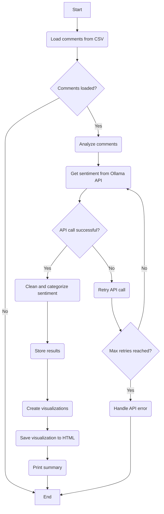

```mermaid
graph TD
    A[Start] --> B(Load comments from CSV);
    B --> C{Comments loaded?};
    C -- Yes --> D(Analyze comments);
    C -- No --> E[End];
    D --> F(Get sentiment from Ollama API);
    F --> G{API call successful?};
    G -- Yes --> H(Clean and categorize sentiment);
    H --> I(Store results);
    I --> J(Create visualizations);
    G -- No --> K(Retry API call);
    K --> L{Max retries reached?};
    L -- Yes --> M(Handle API error);
    L -- No --> F;
    J --> N(Save visualization to HTML);
    N --> O(Print summary);
    O --> E;
    M --> E;
```
